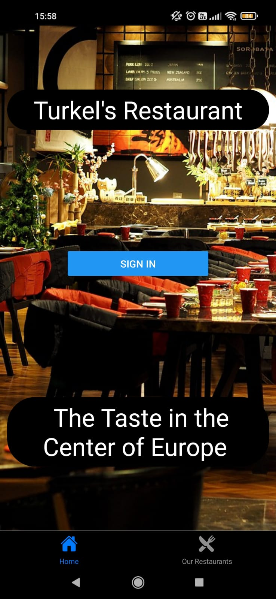
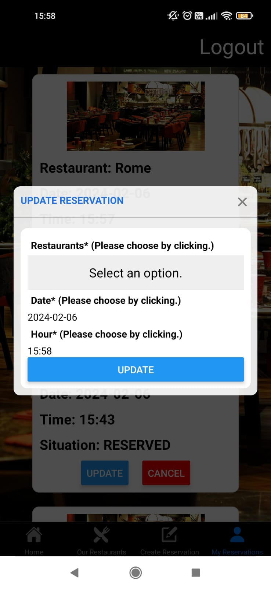
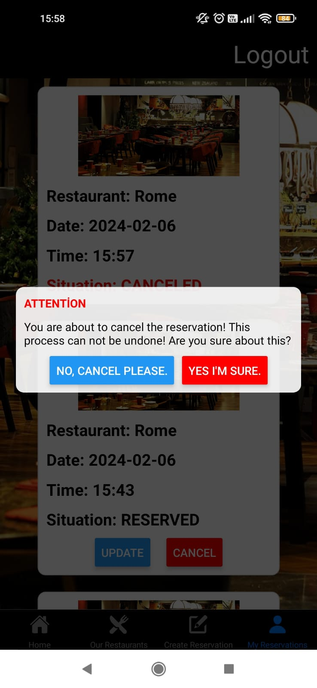
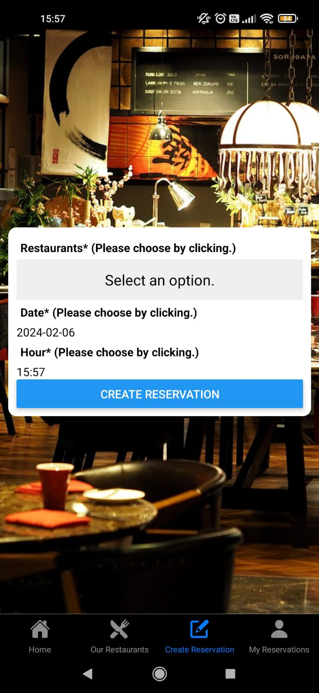
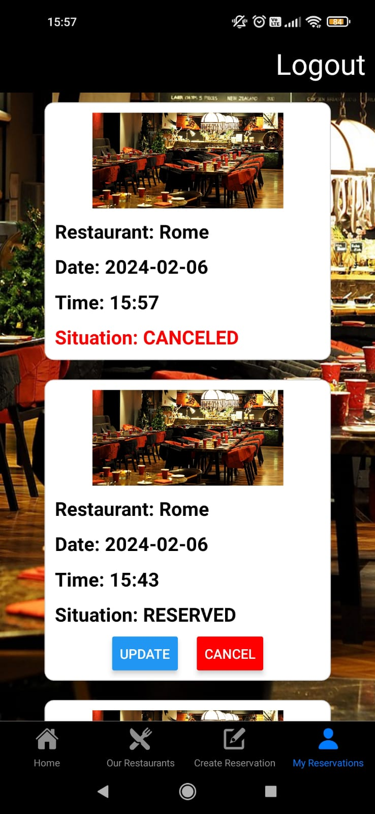
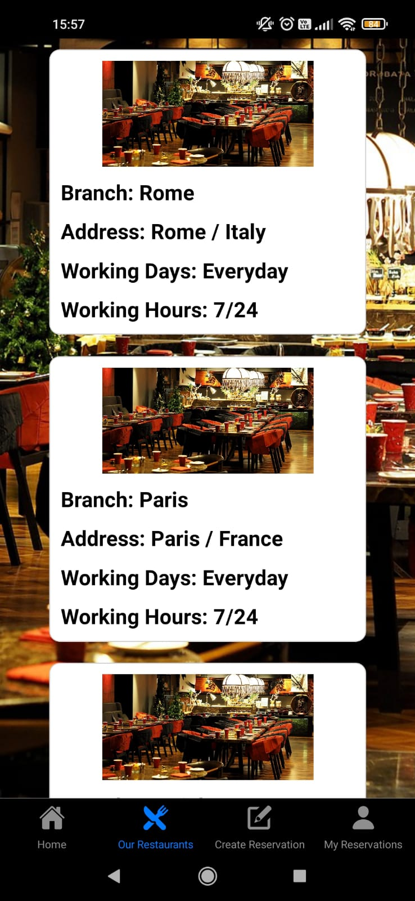

# native-restaurantapp

This repo is the native app of fullstack RestaurantApp. Restaurant-app is a project that you can see restaurants and you can create reservation by choosing date and time. Then you can see your reservations and update and cancel.
To see web repo you can visit [Frontend-Restaurantapp.](https://github.com/Hasan-Turkel/frontend-restaurantapp) and for the backend repo  [Backend-Restaurantapp](https://github.com/Hasan-Turkel/backend-restaurantapi).

## This is how the site looks like.

      

